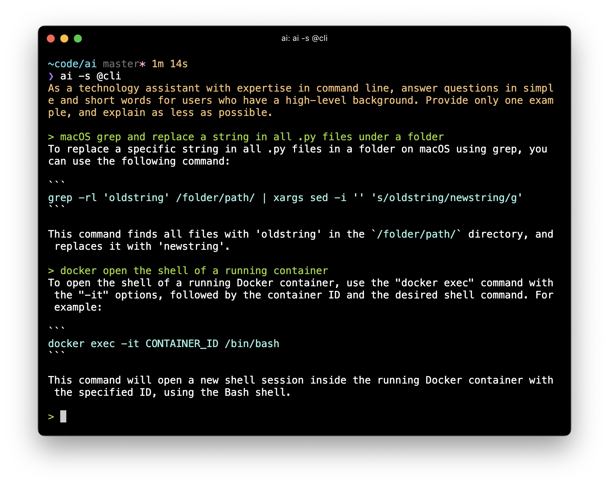

# ai.py

A single-file Python script that interacts with ChatGPT API in the command-line.



Features:
- Use shortcuts to access predefined prompts
- Highlight code in output
- Support one-shot queries and conversations


## Install

Just copy the script to a folder in `$PATH`, like `/usr/local/bin`. You can also change its name to `ai` to get ride of the `.py` extension.

Here's a command that can directly install the script into your system:

```
curl https://raw.githubusercontent.com/reorx/ai.py/master/ai.py -o /usr/local/bin/ai && chmod +x /usr/local/bin/ai
```


## Usage

Paste your OpenAI API key to `~/.ai_py_config.json`, or set it in `AI_PY_API_KEY` environment variable.

```bash
echo '{"api_key":"<Your API key>"}' > ~/.ai_py_config.json'
```

For detail usage of the script, please read the description of `./ai.py -h`:

```
usage: ai [-h] [-s SYSTEM] [-c] [-v] [-d] [--version] [PROMPT]

A simple CLI for ChatGPT API

positional arguments:
  PROMPT                your prompt, leave it empty to run REPL

options:
  -h, --help            show this help message and exit
  -s SYSTEM, --system SYSTEM
                        system message to use at the beginning of the
                        conversation. if starts with @, the message will be
                        located through ~/.ai_py_prompts.json
  -c, --conversation    enable conversation, which means all the messages will
                        be sent to the API, not just the last one. This is
                        only useful to REPL
  -v, --verbose         verbose mode, show params and role name
  -d, --debug           debug mode, enable logging
  --version             show program's version number and exit
```

### One-off query

Pass the prompt as the first argument:

```
./ai.py 'hello world'
```

You can also pass the prompt through a pipe (`|`):

```
head README.md | ./ai.py 'Proofreading the following text:'
```

### REPL

Run without argument for [Read–eval–print loop](https://en.wikipedia.org/wiki/Read%E2%80%93eval%E2%80%93print_loop):

```
./ai.py
```

By default only the last message and the system message are sent to the API,
to enable conversation, add `-c` argument:

```
./ai.py -c
```

### System message

You can pass a system message to define the behavior for the assistant:

```
./ai.py -s 'You are a proofreader' 'its nice know you'
```

You can also save your predefined system messages in `~/.ai_py_promots.json`
and refer them with `@` at the beginning, this will be covered in the next section.


### Prompt shortcuts

You can predefine prompts in `~/.ai_py_prompts.json` and refer to them by using `@` as a prefix.
This works for both system messages and user messages.

Suppose your `~/.ai_py_prompts.json` looks like this:

```json
{
  "system": {
    "cli": "As a technology assistant with expertise in command line, answer questions in simple and short words for users who have a high-level background. Provide only one example, and explain as less as possible."
  },
  "user": {
    "native": "Paraphrase the following sentences to make it more native:\n",
    "revise": "Revise the following sentences to make them more clear concise and coherent:\n",
    "": ""
  }
}
```

Then you can use the `cli` prompt shortcut in system message by:

```
./ai.py -s @cli
```

and use the `native` or `revise` prompt shortcut in user message by:

```
./ai.py '@native its nice know you'

It's great to get to know you.
```

### Verbose mode

Add `-v` to print role name and parameters used in the API call.

<details>
  <summary>Screenshot</summary>

  
</details>
